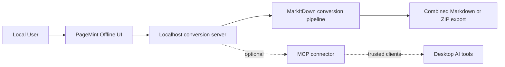

# PageMint Offline


PageMint Offline is a privacy-first document processing application for converting mixed local files into Markdown without sending content to the cloud. It is built on top of [Microsoft MarkItDown](https://github.com/microsoft/markitdown) and is designed for secure localhost execution, local AI tooling workflows, and optional MCP-based desktop integrations.

PageMint is an independent project and is not affiliated with, endorsed by, or sponsored by Microsoft.

## Overview

This project is built for users who want local document conversion with stronger privacy guarantees than browser-based upload tools. Files are processed on the local machine, conversion happens offline, and the app supports both combined Markdown output and separate-file export for mixed batches.

The application exposes a localhost-only interface for interactive use and can optionally provide MCP integration for trusted desktop AI clients that need structured access to local conversion workflows.

## Architecture Diagram



## Features

- Privacy-first local document processing with no cloud upload requirement
- Offline conversion for mixed file batches
- Markdown export as a single combined document or separate files in a ZIP archive
- Localhost-only execution model for safer desktop usage
- Support for common office, text, and structured document formats
- Optional MCP connector for trusted desktop AI workflows
- Temporary per-request processing and cleanup behavior
- Desktop packaging support for macOS connectors and launcher workflows

## Tech Stack

| Layer | Technologies |
| --- | --- |
| Conversion engine | Microsoft MarkItDown |
| Application layer | Python 3.10+, local web app, desktop launcher |
| Security model | Localhost-only binding, CSP, temporary storage, plugin-disabled conversion |
| Integration | Optional MCP connector for desktop AI clients |
| Packaging | macOS connector scripts, Windows connector scripts |

## Project Structure

```text
PageMint-Offline/
|-- README.md
|-- SECURITY.md
|-- NOTICE.md
|-- apps/
|   `-- offline-converter/
|       |-- README.md
|       |-- pyproject.toml
|       |-- docs/
|       |-- tests/
|       |-- connectors/
|       |   |-- macos/
|       |   |-- windows/
|       |   |-- sdk/
|       |   `-- config/
|       `-- src/
|           `-- markitdown_app/
|               |-- desktop_app.py
|               |-- server.py
|               |-- connector.py
|               `-- static/
`-- LICENSE
```

## Installation

Create a local environment and install the app from source:

```bash
python3 -m venv .venv
source .venv/bin/activate
python -m pip install --upgrade pip
pip install -e "apps/offline-converter[test]"
```

## Quick Start

Run tests:

```bash
pytest apps/offline-converter/tests
```

Launch the application:

```bash
markitdown-app
```

Open:

```text
http://127.0.0.1:8765
```

Typical workflow:

1. Upload one or more local files.
2. Choose combined Markdown output or separate-file ZIP export.
3. Let the app detect formats and convert them locally.
4. Download the generated Markdown artifacts.

## Screenshots

Screenshots can be added here to show:

- Upload flow with mixed files
- Combined Markdown preview
- Separate ZIP export workflow
- Local privacy messaging in the UI

Placeholder:

```text
docs/screenshots/
|-- upload-flow.png
|-- combined-output.png
|-- separate-export.png
`-- privacy-ui.png
```

## Security Model

- The application binds to `127.0.0.1` by default and accepts only localhost host headers.
- Uploads are stored in temporary per-request directories and removed after processing.
- Requests are limited by configurable file count and size thresholds.
- Plugins are disabled in the local converter.
- Browser responses use a restrictive content security policy and disable caching.
- The MCP connector can access files readable by the current user and should be connected only to trusted desktop AI clients.

Do not expose the local web server to a public network. See [SECURITY.md](SECURITY.md) for reporting instructions and supported assumptions.

## Future Roadmap

- Improved UI polish for conversion review and export management
- More desktop packaging workflows for distribution
- Additional optional local AI integrations around document workflows
- Better screenshot and demo assets for end-user onboarding
- Expanded documentation for trusted MCP usage patterns
- Future Android packaging path once the mobile execution model is finalized

## Packaging Notes

- macOS build scripts are under `apps/offline-converter/connectors/macos`
- Windows connector scripts are under `apps/offline-converter/connectors/windows`
- Generated installers are intentionally excluded from Git and should be signed and notarized before distribution

## License

This repository is distributed under the MIT License. MarkItDown is an external MIT-licensed dependency. See [LICENSE](LICENSE) and [NOTICE.md](NOTICE.md).
